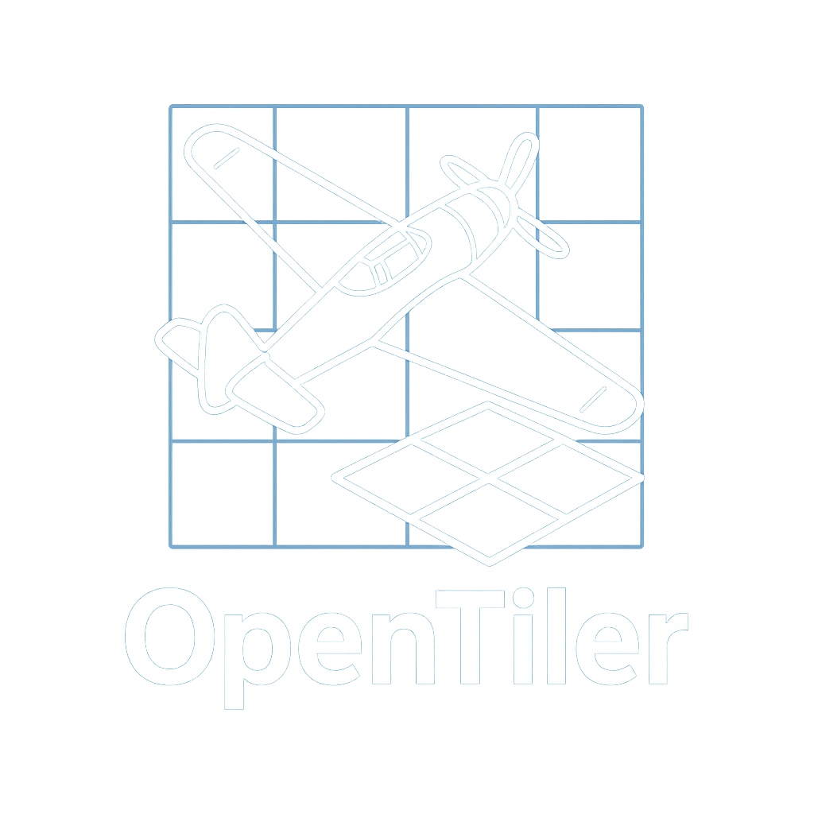
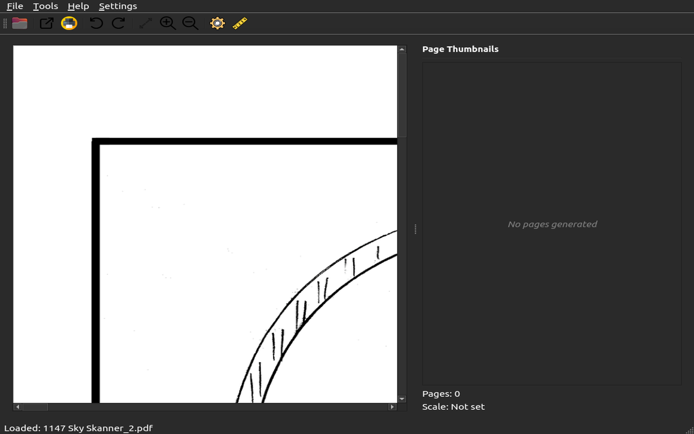
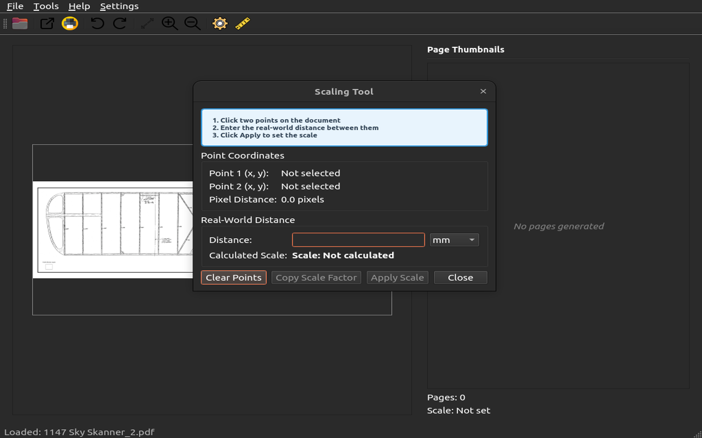
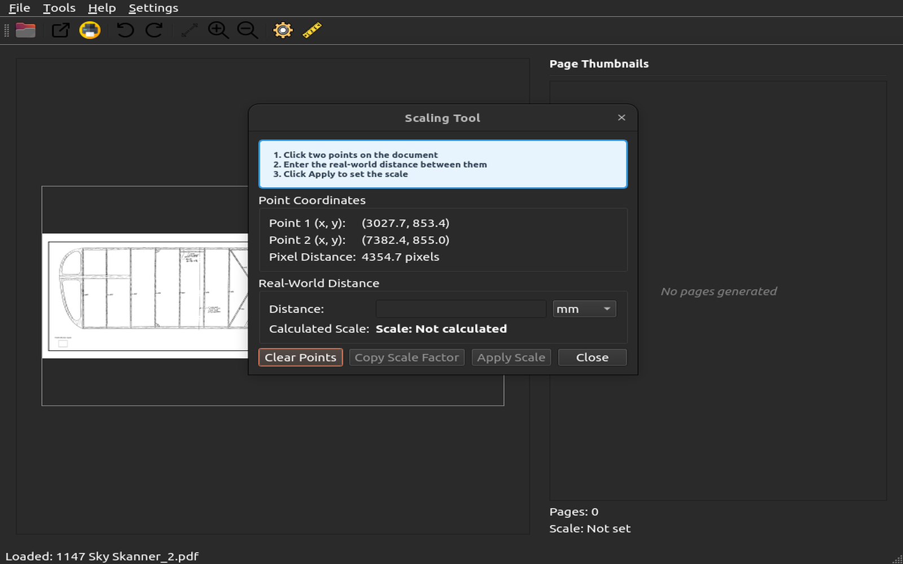
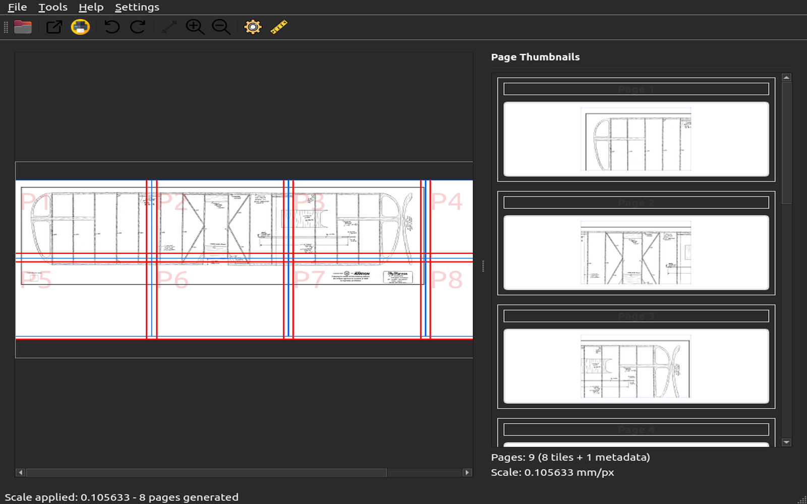

# OpenTiler

[](https://github.com/Monotoba/OpenTiler/actions/workflows/ci.yml)
[](https://github.com/Monotoba/OpenTiler/actions/workflows/basic-test.yml)
[](https://opensource.org/licenses/MIT)
[](https://www.python.org/downloads/)
[](https://www.qt.io/qt-for-python)

A PySide6-based desktop application for scaling and tiling architectural drawings, blueprints, and technical documents.



*Professional document scaling and tiling for architects, engineers, and technical professionals*

## Features

- **Document Support**: Load and view PDF, and many image formats
- **Precise Scaling**: Interactive scaling tool with real-world measurements
- **Professional Tiling**: Multi-page PDF export with assembly guides
- **Unit Conversion**: Convert between millimeters and inches
- **Scale Calculator**: Calculate scale factors and dimensions
- **Tile Preview**: Visual preview of tile layout before export
- **Multiple Formats**: Support for various input and output formats
- **Plugin System**: Extensible architecture with automation support

## Requirements

- Python 3.10+
- PySide6
- Pillow (PIL)
- PyMuPDF

## Installation

1. Clone the repository:
```bash
git clone https://github.com/Monotoba/OpenTiler.git
cd OpenTiler
```

2. Create and activate a virtual environment:
```bash
python3.10 -m venv venv
source venv/bin/activate  # On Windows: venv\Scripts\activate
```

3. Install dependencies:
```bash
pip install -r requirements.txt
```

## Usage

Run the application:
```bash
python main.py
```

### Basic Workflow

#### 1. Load Document
Use File → Open to load a PDF, image, or SVG file:


#### 2. Set Scale Using the Scale Tool
Use Tools → Scaling Tool to set real-world scale:



- Click two points on the document (e.g., wing tips):



- Enter the real-world distance (e.g., 460mm):


- Apply the scale and confirm:



#### 3. View Scaled Document
The document is now properly scaled for accurate measurements:


#### 4. Export Tiles
Use File → Export to save tiled output for printing.

### Tools and Features

- **Scaling Tool**: Set document scale by measuring known distances
- **Unit Converter**: Convert between millimeters and inches
- **Scale Calculator**: Calculate scale factors and dimensions
- **Zoom Controls**: Zoom in/out and fit to window
- **Rotation**: Rotate documents left or right
- **Settings**: Comprehensive configuration options

## Supported Formats

### Input
- **PDF**: Single and multi-page documents
- **Images**: PNG, JPEG, TIFF, BMP
- **Vector**: SVG files

### Output
- Multi-page PDF
- Individual image tiles
- Composite images

## Configuration

The application stores settings automatically, including:
- Default units (mm/inches)
- Default DPI (300)
- Last used directories
- Window layout

Note on page margins and gutters:
- OpenTiler interprets page margins in millimeters. When exporting or printing, the default margins are 10 mm on all sides unless configured otherwise.
- Tile gutters are also specified in millimeters via Settings. The printable area per page is the page size minus margins, and tile drawing is clipped to the area inside the gutter per page for consistent assembly.

## Development

### Project Structure
```
opentiler/
├── main.py              # Application entry point
├── opentiler/
│   ├── main_app.py      # Main application
│   ├── main_window.py   # Main window
│   ├── viewer/          # Document viewer components
│   ├── dialogs/         # Dialog windows
│   ├── exporter/        # Export functionality
│   ├── settings/        # Configuration management
│   └── utils/           # Utility functions
├── docs/                # Documentation
└── tests/               # Unit tests
```

### Running Tests
```bash
pytest tests/
```

### Code Formatting
```bash
black opentiler/
flake8 opentiler/
mypy opentiler/
```

## License

MIT License with Attribution Requirement

## Author

Randall Morgan

## Copyright

© 2025 Randall Morgan
