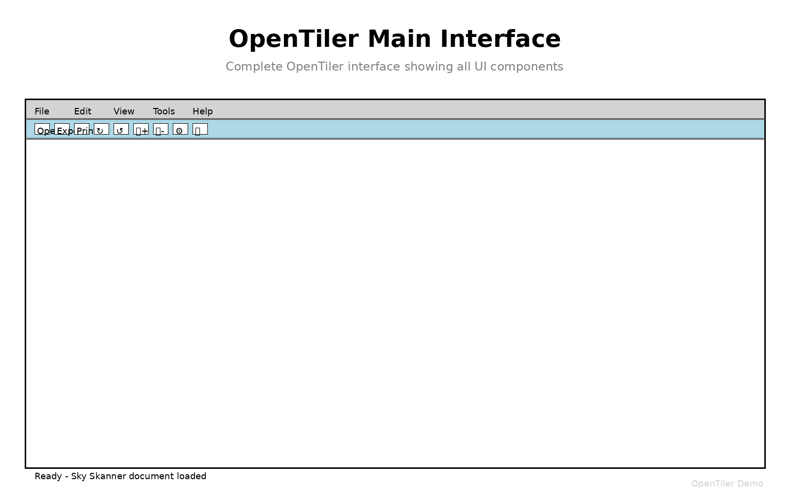
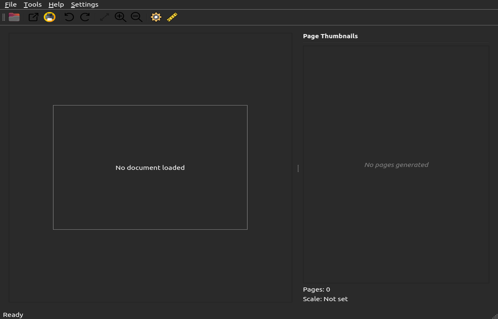

# OpenTiler Documentation

Note: As of version 1.3.0, OpenTiler includes an in-app Help system (Help → Help Contents) that renders Markdown topics from `opentiler/help/`. The in-app help is aligned with the current menu structure and tools.


Welcome to the OpenTiler documentation! OpenTiler is a professional document scaling and tiling application designed for architects, engineers, and professionals who need to print large-format documents on standard printers.

## 🎯 What is OpenTiler?

OpenTiler allows you to:
- **Scale and tile large documents** for printing on standard paper sizes
- **Maintain precise measurements** with built-in scale tools
- **Generate assembly guides** with crop marks and page indicators
- **Export professional-quality tiles** ready for printing and assembly


## 🖥️ Interface Overview

### Main Interface
OpenTiler features a clean, professional interface designed for efficient workflow:



### Toolbar and Tools
The toolbar provides quick access to all essential functions:


### Preview Panel
The preview panel shows how your document will be tiled:



## 📚 Documentation Overview

### 🚀 [Installation Guide](INSTALLATION.md)
Complete installation instructions for Windows, Linux, and macOS, including:
- Python setup and virtual environments
- Core and optional dependency installation
- Platform-specific instructions
- FreeCAD integration setup
- Installation verification

### ❓ [Frequently Asked Questions (FAQ)](FAQ.md)
Comprehensive FAQ covering:
- DXF and FreeCAD support setup
- Common installation issues
- Platform-specific problems
- Performance optimization
- Professional workflow integration
- Emergency fixes and quick reference

### 🔧 [Troubleshooting Guide](TROUBLESHOOTING.md)
Detailed troubleshooting for:
- Application startup issues
- File loading problems
- Performance optimization
- Export and printing issues
- CAD integration problems
- Debug mode and diagnostic tools

## 🎯 Quick Start

### New Users
1. **Start here:** [Installation Guide](INSTALLATION.md)
2. **Having issues?** Check [FAQ](FAQ.md)
3. **Need help?** See [Troubleshooting](TROUBLESHOOTING.md)

### Experienced Users
- **Quick reference:** [FAQ Summary](FAQ.md#frequently-asked-questions-summary)
- **Emergency fixes:** [FAQ Emergency Fixes](FAQ.md#emergency-fixes)
- **Debug commands:** [Troubleshooting Debug Mode](TROUBLESHOOTING.md#debug-mode)

## 🔍 Find What You Need

### Installation Issues
| Problem | Solution Location |
|---------|------------------|
| Python not found | [Installation Guide - Platform Instructions](INSTALLATION.md#detailed-platform-instructions) |
| Dependencies missing | [FAQ - DXF/FreeCAD Support](FAQ.md#dxf-support) |
| Permission errors | [Troubleshooting - Application Won't Start](TROUBLESHOOTING.md#application-wont-start) |
| Virtual environment | [Installation Guide - Basic Installation](INSTALLATION.md#basic-installation) |

### Runtime Issues
| Problem | Solution Location |
|---------|------------------|
| Files won't load | [Troubleshooting - File Loading Issues](TROUBLESHOOTING.md#file-loading-issues) |
| Slow performance | [FAQ - Performance Issues](FAQ.md#performance-issues-with-large-files) |
| Export problems | [Troubleshooting - Export and Printing](TROUBLESHOOTING.md#export-and-printing-issues) |
| Scale/measurement | [Troubleshooting - Scaling Issues](TROUBLESHOOTING.md#scaling-and-measurement-issues) |

### CAD Integration
| Problem | Solution Location |
|---------|------------------|
| DXF not working | [FAQ - DXF Support](FAQ.md#dxf-support) |
| FreeCAD not detected | [FAQ - FreeCAD Support](FAQ.md#freecad-support) |
| AutoCAD workflow | [FAQ - Integration with Other Software](FAQ.md#integration-with-other-software) |
| Format conversion | [FAQ - Save-As vs Export](FAQ.md#can-i-use-opentiler-as-a-library) |

## 🛠️ Quick Diagnostic Commands

### Check Installation Status
```bash
# Basic system check
python --version
pip list | grep -E "(PySide6|PyPDF2|ezdxf|matplotlib)"

# Test OpenTiler modules
python -c "
from opentiler.formats.dxf_handler import DXFHandler
from opentiler.formats.freecad_handler import FreeCADHandler
print('DXF Support:', DXFHandler.is_available())
print('FreeCAD Support:', FreeCADHandler.is_available())
"
```

### Emergency Reset
```bash
# Complete reinstall
pip uninstall PySide6 PyPDF2 ezdxf matplotlib
pip install PySide6 PyPDF2 ezdxf matplotlib

# Reset virtual environment
rm -rf venv && python -m venv venv
source venv/bin/activate && pip install PySide6 PyPDF2 ezdxf matplotlib
```

## 📋 Common Solutions

### "DXF support not available"
```bash
pip install ezdxf matplotlib
```

### "FreeCAD support not available"
```bash
# Linux
sudo apt install freecad
# or sudo snap install freecad

# macOS
brew install --cask freecad

# Windows: Download from freecadweb.org
```

### Application won't start
```bash
# Check virtual environment
source venv/bin/activate  # Linux/Mac
# or venv\Scripts\activate  # Windows

# Reinstall core dependencies
pip install --force-reinstall PySide6 PyPDF2
```

## 🎓 Learning Path

### Beginner
1. **Install OpenTiler:** Follow [Installation Guide](INSTALLATION.md)
2. **Test basic functionality:** Load a PDF, try scaling
3. **Learn the interface:** Explore menus and tools
4. **Try tiling:** Generate and export tiles

### Intermediate
1. **CAD Integration:** Set up [DXF](FAQ.md#dxf-support) and [FreeCAD](FAQ.md#freecad-support) support
2. **Professional workflow:** Learn [printing best practices](FAQ.md#printing-and-assembly)
3. **Quality control:** Use scale lines and measurement verification
4. **Troubleshooting:** Familiarize with [common issues](TROUBLESHOOTING.md)

### Advanced
1. **Customization:** Explore [development setup](FAQ.md#development-and-customization)
2. **Integration:** Set up workflows with [other CAD software](FAQ.md#integration-with-other-software)
3. **Performance:** Optimize for [large files](FAQ.md#performance-issues-with-large-files)
4. **Automation:** Use OpenTiler as a [library](FAQ.md#can-i-use-opentiler-as-a-library)

## 🆘 Getting Help

### Self-Help Resources
1. **Search the FAQ:** Most common issues are covered
2. **Try troubleshooting steps:** Follow the systematic approach
3. **Check diagnostic commands:** Verify your installation
4. **Test with different files:** Isolate the problem

### Community Support
1. **GitHub Issues:** Report bugs with diagnostic information
2. **Discussions:** Ask questions and share tips
3. **Documentation:** Contribute improvements and corrections

### Reporting Issues
When reporting problems, include:
```bash
# System information
python --version
pip list | grep -E "(PySide6|PyPDF2|ezdxf|matplotlib)"

# OpenTiler status
python -c "
from opentiler.formats.dxf_handler import DXFHandler
from opentiler.formats.freecad_handler import FreeCADHandler
print('DXF:', DXFHandler.is_available())
print('FreeCAD:', FreeCADHandler.is_available())
"
```

## 📝 Contributing to Documentation

Help improve these docs:
1. **Found an error?** Create an issue or pull request
2. **Missing information?** Suggest additions
3. **Unclear instructions?** Propose clarifications
4. **New solutions?** Share your discoveries

## 🔗 External Resources

### Dependencies
- **PySide6:** https://doc.qt.io/qtforpython/
- **ezdxf:** https://ezdxf.readthedocs.io/
- **matplotlib:** https://matplotlib.org/stable/
- **FreeCAD:** https://wiki.freecadweb.org/

### Related Tools
- **AutoCAD:** Professional CAD software
- **LibreCAD:** Open-source 2D CAD
- **QCAD:** Cross-platform CAD application
- **Inkscape:** Vector graphics editor (SVG support)

---

*Documentation last updated: December 2024*

*For the most current information, check the GitHub repository.*
